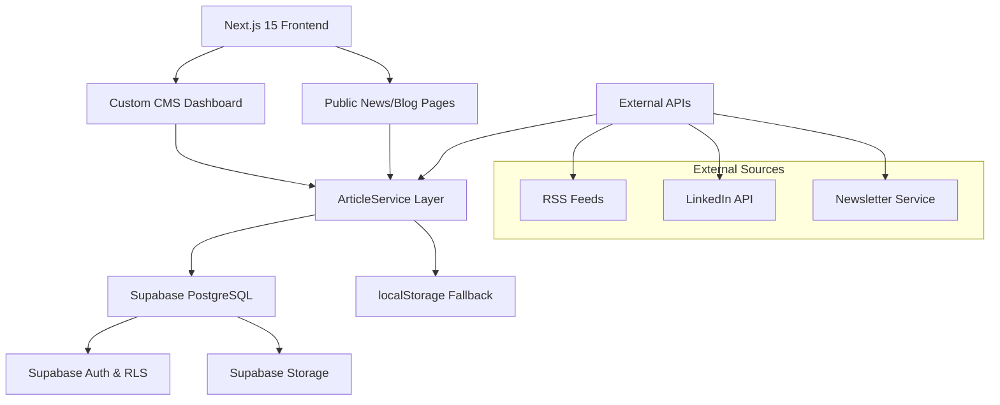

# ADR-001: CMS Architecture Decision for News/Blog System

**Status**: Proposed  
**Date**: 2025-08-29  
**Deciders**: Chief Architect Agent, Development Team  
**Technical Story**: [CMS_ARCHITECTURE_ANALYSIS.md](./CMS_ARCHITECTURE_ANALYSIS.md)

---

## Context

The Workflo new project currently implements a dual-CMS architecture with both Supabase and Payload CMS for managing news and blog content. This approach has created architectural complexity and compatibility issues:

### Current Issues
- **Payload CMS Incompatibility**: Cannot function with Next.js 15 due to `useConfig()` destructuring errors
- **Dual Database Complexity**: Both Supabase and local PostgreSQL configured, creating potential inconsistencies
- **Authentication Gap**: No proper authentication system for content management
- **Maintenance Overhead**: Two different CMS systems require separate maintenance

### Business Requirements
- Robust content management for news articles and blog posts
- Multi-language support (Dutch/English)
- SEO-friendly content delivery
- Integration with external sources (RSS, LinkedIn)
- Scalable architecture for future growth
- Editor-friendly interface for non-technical users
- Cost-effective solution

### Technical Constraints
- Must work with Next.js 15
- TypeScript requirement
- Existing Supabase integration
- Need for real-time updates
- Mobile-responsive content management

---

## Decision

We will adopt a **Supabase-First Architecture** and deprecate Payload CMS from the system.

### Chosen Architecture



### Core Components

1. **Database Layer**: Supabase PostgreSQL with comprehensive articles schema
2. **Authentication**: Supabase Auth with row-level security
3. **Content Management**: Enhanced custom CMS dashboard
4. **File Storage**: Supabase Storage for media assets
5. **API Layer**: Next.js API routes with robust error handling
6. **Frontend**: React-based content delivery with SSG/SSR

---

## Rationale

### Why Supabase-First?

#### ✅ Advantages
- **Single Source of Truth**: Eliminates dual-database complexity
- **Next.js 15 Compatibility**: No compatibility issues
- **Built-in Authentication**: Robust auth system with RLS
- **Real-time Capabilities**: Live updates for collaborative editing
- **Scalability**: Auto-scaling database with global CDN
- **File Storage**: Integrated media management
- **Cost Effective**: Excellent price-performance ratio
- **Developer Experience**: Great TypeScript support and tooling

#### ⚠️ Trade-offs
- **Custom UI Development**: Need to build admin interface (already done)
- **Vendor Lock-in**: Dependency on Supabase ecosystem
- **Learning Curve**: Team needs Supabase expertise

### Why Not Payload CMS?

#### ❌ Disadvantages
- **Next.js 15 Incompatibility**: Fundamental blocking issue
- **Additional Complexity**: Separate database and deployment requirements
- **Development Overhead**: Need to maintain compatibility layers
- **Resource Usage**: Additional server resources required

### Why Not Alternative Headless CMS?

#### Considered Options
- **Sanity**: Rich editor but adds complexity and cost
- **Strapi**: Open source but requires separate hosting
- **Contentful**: Enterprise features but expensive for current needs
- **Ghost**: Blog-focused but limited customization

#### Decision Factors
- Current Supabase integration is working well
- Custom CMS dashboard already built and functional
- Team expertise with React/TypeScript
- Cost considerations favor integrated solution

---

## Consequences

### What Becomes Easier ✅

1. **Development Workflow**
   - Single codebase for all CMS functionality
   - Unified deployment process
   - Consistent error handling and logging

2. **Maintenance**
   - One database system to monitor and maintain
   - Unified backup and recovery processes
   - Simplified security model

3. **Performance**
   - Reduced complexity improves response times
   - Built-in caching and CDN integration
   - Optimized database queries

4. **Feature Development**
   - Real-time collaboration features
   - Advanced search capabilities
   - Integrated file management
   - Role-based access control

### What Becomes More Difficult ⚠️

1. **Admin Interface**
   - Need to continuously develop custom CMS features
   - Less out-of-the-box functionality compared to mature CMS
   - Requires more frontend development effort

2. **Content Modeling**
   - Manual schema management (though tools exist)
   - Need to build custom field types for complex content

3. **Migration Path**
   - One-time effort to clean up Payload CMS code
   - Need to ensure data consistency during transition

### New Capabilities Enabled 🚀

1. **Real-time Features**
   - Live collaborative editing
   - Real-time content updates
   - WebSocket-based notifications

2. **Advanced Integration**
   - Better external API integration
   - Custom workflow automation
   - Advanced analytics integration

3. **Performance Optimization**
   - Edge function capabilities
   - Incremental static regeneration
   - Advanced caching strategies

---

## Implementation Plan

### Phase 1: Foundation (Week 1-2)
```typescript
// Priority Tasks
1. Remove Payload CMS dependencies from package.json
2. Clean up payload.config.ts and related files
3. Implement Supabase Auth in CMS dashboard
4. Add environment variable validation
5. Set up production Supabase project
```

### Phase 2: Enhancement (Week 3-4)
```typescript
// Feature Development
1. Implement Supabase Storage for image uploads
2. Add role-based access control
3. Enhance search functionality with full-text search
4. Add content scheduling features
5. Implement audit logging
```

### Phase 3: Integration (Week 5-6)
```typescript
// External Integrations
1. Improve RSS feed integration
2. Enhance LinkedIn API integration
3. Add newsletter service integration
4. Implement SEO optimization features
5. Add analytics tracking
```

### Phase 4: Production (Week 7-8)
```typescript
// Production Readiness
1. Performance optimization
2. Security audit and hardening
3. Backup and disaster recovery setup
4. Monitoring and alerting
5. Documentation and training
```

---

## Alternatives Considered

### Option A: Keep Dual CMS Architecture
**Rejected** because:
- Payload CMS compatibility issues with Next.js 15
- Unnecessary complexity and maintenance overhead
- Higher infrastructure costs
- Potential data consistency issues

### Option B: Downgrade to Next.js 14
**Rejected** because:
- Loses Next.js 15 performance improvements
- Blocks future upgrades
- Technical debt accumulation
- Goes against modern development practices

### Option C: Switch to External Headless CMS
**Rejected** because:
- Additional monthly costs ($50-200+/month)
- Migration complexity
- Existing Supabase investment
- Current custom CMS already meets needs

### Option D: Pure Static Site Generation
**Rejected** because:
- Loses real-time content management
- Limited content editor capabilities
- Complex content workflow requirements
- Doesn't meet business requirements for dynamic content

---

## Success Metrics

### Technical Metrics
- [ ] API response time < 200ms (95th percentile)
- [ ] Database query performance < 50ms average
- [ ] 99.9% system uptime
- [ ] Zero critical security vulnerabilities
- [ ] Build time < 60 seconds
- [ ] Lighthouse performance score > 90

### Business Metrics
- [ ] Content publishing time reduced by 50%
- [ ] Editor satisfaction score > 4.5/5
- [ ] Content management tasks completed 30% faster
- [ ] SEO rankings maintained or improved
- [ ] Infrastructure costs reduced by 20%
- [ ] Developer productivity increased by 40%

### Quality Metrics
- [ ] Test coverage > 85%
- [ ] Code complexity score < 10
- [ ] Documentation coverage > 90%
- [ ] Zero data loss incidents
- [ ] Security audit pass rate 100%
- [ ] Performance regression tests pass

---

## Validation Criteria

The architecture decision will be considered successful if:

1. **Functional Requirements**
   - ✅ All existing CMS functionality preserved
   - ✅ Multi-language content management working
   - ✅ External API integrations functional
   - ✅ Search and filtering capabilities maintained

2. **Non-Functional Requirements**
   - ✅ System performance meets or exceeds current levels
   - ✅ Security posture improved with proper authentication
   - ✅ Scalability demonstrates capability for 10x growth
   - ✅ Maintainability score improved in code quality tools

3. **Team Adoption**
   - ✅ Content editors can use new system effectively
   - ✅ Developers report improved development experience
   - ✅ Infrastructure team reports reduced operational complexity

---

## Risk Mitigation

### Technical Risks

| Risk | Impact | Probability | Mitigation |
|------|---------|-------------|------------|
| Supabase service outage | High | Low | Implement localStorage fallback, backup strategies |
| Data migration issues | High | Medium | Comprehensive testing, rollback procedures |
| Performance degradation | Medium | Low | Performance monitoring, optimization strategies |
| Security vulnerabilities | High | Low | Regular security audits, penetration testing |

### Business Risks

| Risk | Impact | Probability | Mitigation |
|------|---------|-------------|------------|
| Editor workflow disruption | Medium | Medium | Training, gradual rollout, documentation |
| SEO ranking impact | High | Low | Careful migration, redirect strategies |
| Content loss during migration | High | Low | Multiple backups, phased approach |
| Increased development time | Medium | Medium | Proper planning, resource allocation |

---

## Monitoring and Review

### Review Schedule
- **1 Month Post-Implementation**: Technical metrics review
- **3 Months Post-Implementation**: Business impact assessment
- **6 Months Post-Implementation**: Architecture decision validation
- **12 Months Post-Implementation**: Strategic architecture review

### Key Performance Indicators
- System reliability and uptime metrics
- Content management efficiency metrics
- Developer productivity metrics
- Security incident metrics
- Cost optimization metrics

### Decision Review Criteria
This ADR should be reviewed if:
- Supabase fundamentally changes their service offering
- Business requirements significantly change
- Technical landscape shifts (e.g., major framework changes)
- Performance or security issues cannot be resolved
- Cost structure becomes prohibitive

---

## References

- [CMS_ARCHITECTURE_ANALYSIS.md](./CMS_ARCHITECTURE_ANALYSIS.md) - Detailed technical analysis
- [Supabase Documentation](https://supabase.com/docs)
- [Next.js 15 Documentation](https://nextjs.org/docs)
- [Current Payload Configuration](./payload.config.ts)
- [Articles API Implementation](./app/api/cms/articles/route.ts)

---

**ADR Status**: Proposed  
**Next Review Date**: 2025-09-29  
**Approval Required**: Development Team Lead, Product Owner