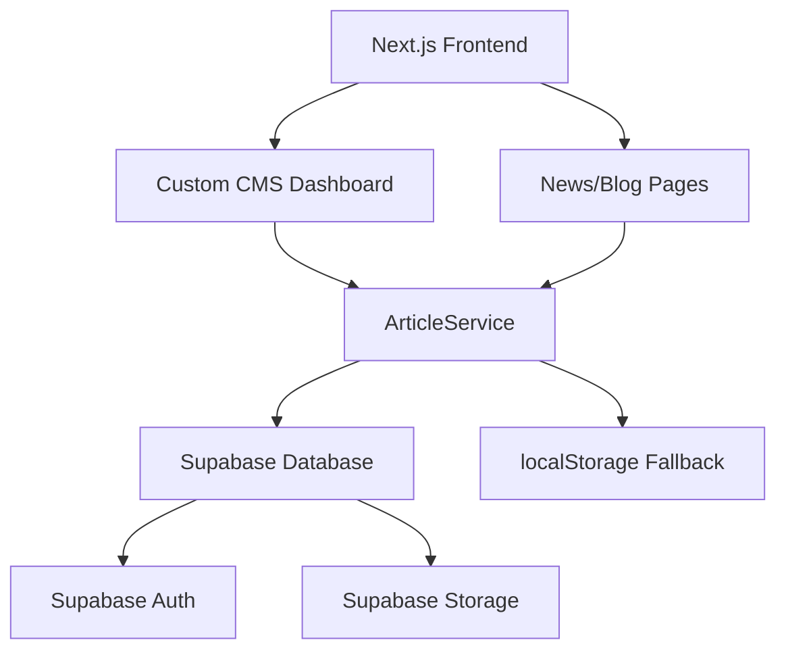
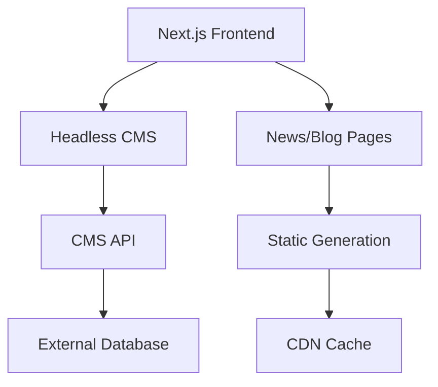
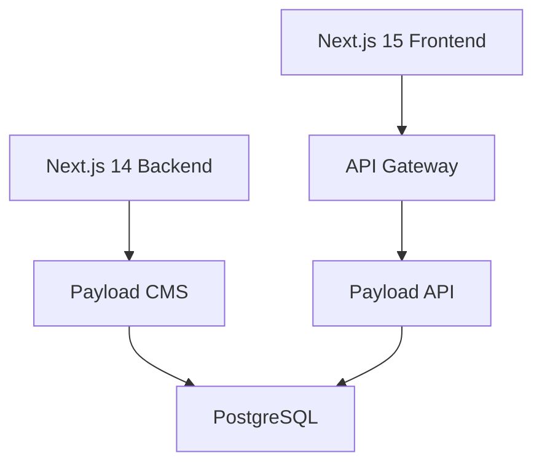

# CMS & Database Architecture Analysis
**Workflo New Project - News/Blog System**

---

## Executive Summary

The current CMS and database setup for the news/blog system shows a **dual-architecture approach** with both Supabase and Payload CMS implementations. While the system is functional, it presents architectural complexity and integration challenges that require strategic decisions for production deployment.

**Key Findings:**
- ✅ Supabase integration is configured and working
- ⚠️ Payload CMS has compatibility issues with Next.js 15
- ✅ Robust fallback system using localStorage
- ⚠️ Dual CMS approach creates maintenance overhead
- ✅ Well-structured API layer with error handling

---

## Current State Analysis

### 1. Database Layer

#### Supabase Configuration ✅
- **Status**: Properly configured and connected
- **URL**: `https://wmasliwvesxtzmlxngoe.supabase.co`
- **Tables**: Articles table with comprehensive schema
- **Features**: 
  - Row Level Security enabled
  - Proper indexing for performance
  - Multi-language support (EN/NL)
  - Rich metadata (tags, categories, featured status)

```sql
-- Current Articles Schema
CREATE TABLE articles (
  id UUID DEFAULT gen_random_uuid() PRIMARY KEY,
  title TEXT NOT NULL,
  title_nl TEXT,
  slug TEXT UNIQUE NOT NULL,
  excerpt TEXT,
  excerpt_nl TEXT,
  content TEXT,
  content_nl TEXT,
  author TEXT DEFAULT 'Workflo Team',
  category TEXT DEFAULT 'Nieuws',
  tags TEXT[] DEFAULT '{}',
  image TEXT,
  published BOOLEAN DEFAULT false,
  featured BOOLEAN DEFAULT false,
  source TEXT DEFAULT 'cms',
  external_url TEXT,
  published_at TIMESTAMPTZ,
  created_at TIMESTAMPTZ DEFAULT NOW(),
  updated_at TIMESTAMPTZ DEFAULT NOW()
);
```

#### Local PostgreSQL (Development) ⚠️
- **Status**: Alternative database for development
- **Connection**: `postgresql://florian@localhost:5432/workflo_cms`
- **Purpose**: Used by Payload CMS
- **Issue**: Creates complexity with dual database setup

### 2. CMS Layer

#### Custom CMS Dashboard ✅
- **Location**: `/app/cms/page.tsx`
- **Status**: Fully functional
- **Features**:
  - Article CRUD operations
  - Rich form validation
  - Tag management
  - Publication status control
  - Statistics dashboard
  - Multi-language support

#### Payload CMS ⚠️
- **Status**: Configured but incompatible with Next.js 15
- **Error**: `Cannot destructure property 'config' of useConfig()`
- **Location**: `/payload.config.ts`
- **Collections**: Comprehensive schema defined
- **Issue**: Known compatibility issue between Payload v3 and Next.js 15

### 3. Service Layer

#### ArticleService ✅
- **Location**: `/lib/services/article-service.ts`
- **Features**:
  - Database-first with localStorage fallback
  - Comprehensive error handling
  - CRUD operations
  - Search and filtering
  - Pagination support

#### API Layer ✅
- **Location**: `/app/api/cms/articles/route.ts`
- **Features**:
  - RESTful endpoints
  - Mock data fallback
  - Error handling
  - Query parameter support

### 4. Storage Layer

#### ArticleStorage (localStorage) ✅
- **Purpose**: Client-side fallback storage
- **Features**:
  - Browser-based persistence
  - Search capabilities
  - CRUD operations
  - Data validation

### 5. Frontend Integration

#### News Page ✅
- **Location**: `/app/nieuws/page.tsx`
- **Features**:
  - Dynamic content loading
  - Multi-source aggregation (CMS, RSS, LinkedIn)
  - Search and filtering
  - Responsive design
  - Loading states and error handling

---

## Architectural Issues Identified

### Critical Issues 🔴

1. **Payload CMS Compatibility**
   - Next.js 15 incompatibility prevents admin panel usage
   - Impact: Limited to custom CMS dashboard only

2. **Dual Database Configuration**
   - Both Supabase and local PostgreSQL configured
   - Risk: Confusion and potential data inconsistency

### Medium Issues 🟡

3. **Environment Variable Gaps**
   - Missing Supabase service role key
   - Incomplete HubSpot configuration
   - Missing production database password

4. **Authentication Layer Missing**
   - No proper authentication for CMS access
   - Mock user system in place

5. **Image Management**
   - No file upload system
   - Relies on external URLs only

### Low Issues 🟢

6. **Storage Synchronization**
   - No sync between localStorage and database
   - Potential data loss on device switch

---

## Quality Attributes Assessment

### Scalability 📈
- **Database**: Excellent (Supabase auto-scaling)
- **API**: Good (Next.js API routes)
- **Storage**: Limited (localStorage constraints)
- **Rating**: 7/10

### Security 🔒
- **Database**: Good (RLS enabled)
- **Authentication**: Poor (missing proper auth)
- **API**: Moderate (no rate limiting)
- **Rating**: 5/10

### Performance ⚡
- **Database**: Excellent (indexed queries)
- **Caching**: Limited (no CDN integration)
- **Client**: Good (React optimization)
- **Rating**: 7/10

### Maintainability 🔧
- **Code Structure**: Excellent (clean separation)
- **Documentation**: Good (inline comments)
- **Complexity**: High (dual CMS approach)
- **Rating**: 6/10

---

## Recommended Architecture

### Option 1: Supabase-First Architecture (Recommended) ⭐



**Benefits:**
- Single source of truth
- Built-in authentication
- Real-time capabilities
- File storage included
- Excellent scalability

**Implementation Steps:**
1. Remove Payload CMS dependencies
2. Implement Supabase Auth for CMS access
3. Add Supabase Storage for image uploads
4. Create role-based permissions
5. Add real-time subscriptions

### Option 2: Headless CMS Integration



**Alternative CMSs:**
- **Sanity**: Rich editing experience
- **Strapi**: Open-source flexibility
- **Contentful**: Enterprise features
- **Ghost**: Blog-focused

### Option 3: Enhanced Payload Setup



**Requirements:**
- Separate Next.js 14 service for Payload
- API gateway for frontend integration
- More complex deployment

---

## Integration Points to Fix

### 1. Authentication System
- Implement Supabase Auth
- Role-based access control
- Session management
- Password reset functionality

### 2. Image Management
- Supabase Storage integration
- Image upload component
- Automatic resizing/optimization
- CDN integration

### 3. Search Enhancement
- Full-text search with PostgreSQL
- Search indexing
- Advanced filtering
- Search analytics

### 4. Multi-language Support
- Content translation workflow
- Language switching
- SEO optimization per language

### 5. External Integrations
- RSS feed management
- LinkedIn API integration
- Newsletter service connection
- Analytics tracking

---

## Production Deployment Strategy

### Phase 1: Foundation (Week 1-2)
- [ ] Remove Payload CMS dependencies
- [ ] Implement Supabase Auth
- [ ] Add proper environment configuration
- [ ] Set up production database

### Phase 2: Core Features (Week 3-4)
- [ ] Image upload system
- [ ] Enhanced search functionality
- [ ] User role management
- [ ] API rate limiting

### Phase 3: Enhancement (Week 5-6)
- [ ] Real-time updates
- [ ] Advanced analytics
- [ ] Content scheduling
- [ ] Backup systems

### Phase 4: Optimization (Week 7-8)
- [ ] Performance tuning
- [ ] SEO optimization
- [ ] CDN integration
- [ ] Monitoring setup

---

## Cost Analysis

### Current Setup Costs
- **Supabase**: Free tier → $25/month (Pro)
- **Development Time**: High (dual maintenance)
- **Infrastructure**: Minimal

### Recommended Setup Costs
- **Supabase Pro**: $25/month
- **CDN (optional)**: $10-50/month
- **Development Time**: Medium (single system)
- **Maintenance**: Low

---

## Risk Assessment

### Technical Risks
- **High**: Payload CMS compatibility issues
- **Medium**: Data migration complexity
- **Low**: Supabase vendor lock-in

### Business Risks
- **High**: Content management disruption
- **Medium**: SEO impact during migration
- **Low**: Learning curve for editors

### Mitigation Strategies
1. **Gradual Migration**: Phase out Payload gradually
2. **Data Backup**: Comprehensive backup before changes
3. **Testing Environment**: Staging environment for validation
4. **Training**: Editor training on new system

---

## Success Metrics

### Technical KPIs
- API response time < 200ms
- Database query time < 50ms
- 99.9% uptime
- Zero data loss events

### Business KPIs
- Content publishing time reduced by 50%
- Editor satisfaction score > 4.5/5
- SEO rankings maintained/improved
- Content discovery increased by 25%

---

## Next Steps

### Immediate Actions (This Week)
1. **Decision**: Choose between Option 1 (Supabase-First) or Option 2 (Headless CMS)
2. **Planning**: Create detailed migration plan
3. **Environment**: Set up staging environment
4. **Backup**: Create comprehensive data backup

### Short-term (Next 2 Weeks)
1. **Implementation**: Begin chosen architecture implementation
2. **Authentication**: Implement proper auth system
3. **Testing**: Comprehensive testing on staging
4. **Documentation**: Update API documentation

### Medium-term (Next Month)
1. **Migration**: Complete system migration
2. **Training**: Editor training sessions
3. **Optimization**: Performance optimization
4. **Monitoring**: Implement monitoring and alerts

---

## Conclusion

The current dual-CMS architecture, while functional, presents unnecessary complexity and maintenance overhead. **I strongly recommend proceeding with Option 1 (Supabase-First Architecture)** for the following reasons:

1. **Simplicity**: Single system reduces complexity
2. **Reliability**: Proven scalability and performance
3. **Features**: Built-in auth, storage, and real-time capabilities
4. **Cost-effectiveness**: Excellent value for money
5. **Future-proofing**: Modern architecture with growth potential

This approach will provide a robust, scalable, and maintainable CMS solution that meets both current needs and future growth requirements while significantly reducing operational complexity.