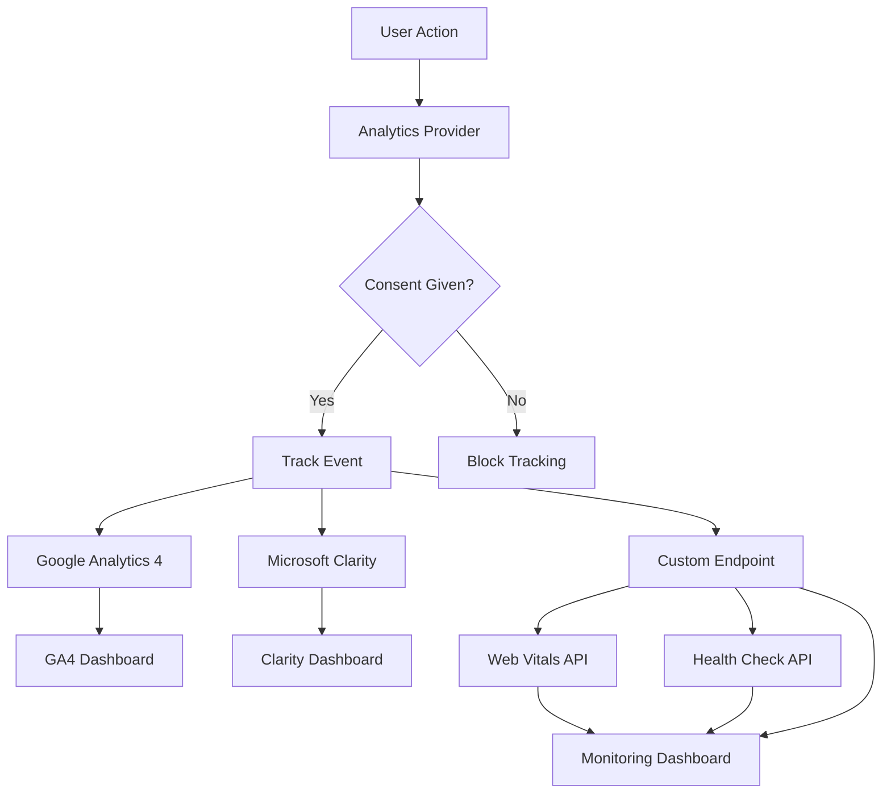

# Comprehensive Monitoring & Analytics Setup - Complete Guide

## 🎉 Setup Complete!

Your Workflo production site now has comprehensive monitoring and analytics capabilities implemented. This guide provides everything you need to configure and maintain the system.

## 📊 What's Been Implemented

### 1. Analytics Services
- ✅ **Google Analytics 4** with enhanced e-commerce tracking
- ✅ **Microsoft Clarity** for session recordings and heatmaps
- ✅ **Sentry** for error monitoring and performance tracking
- ✅ **Web Vitals** collection for Core Web Vitals monitoring
- ✅ **Custom Analytics Library** with unified tracking interface

### 2. Error Monitoring
- ✅ **React Error Boundaries** at component, page, and critical levels
- ✅ **Sentry Integration** with proper filtering and performance monitoring
- ✅ **JavaScript Error Tracking** with automatic error capture
- ✅ **Unhandled Promise Rejection** tracking

### 3. Performance Monitoring
- ✅ **Web Vitals Collection** (CLS, FCP, FID, LCP, TTFB)
- ✅ **Custom Performance Metrics** endpoint
- ✅ **Scroll Depth Tracking** (25%, 50%, 75%, 90%, 100%)
- ✅ **Time on Page Tracking** (30s, 1m, 2m, 5m, 10m intervals)

### 4. Health Monitoring
- ✅ **Health Check Endpoint** (`/api/monitoring/health`)
- ✅ **System Status Dashboard** (`/admin/monitoring`)
- ✅ **Database Connection Monitoring**
- ✅ **External API Health Checks**
- ✅ **Memory and Resource Usage Monitoring**

### 5. GDPR Compliance
- ✅ **Cookie Consent Management** with granular controls
- ✅ **Analytics Consent Integration** 
- ✅ **Data Minimization** and IP anonymization
- ✅ **User Rights Management** (opt-out, data export)

## 🛠 File Structure Created

```
/lib/
├── analytics.ts                    # Main analytics library
├── sentry.ts                      # Sentry configuration
└── analytics/
    ├── consent-manager.ts         # GDPR consent management
    └── config.ts                  # Analytics configuration

/components/
├── analytics/
│   ├── analytics-provider.tsx    # Main analytics wrapper
│   ├── google-analytics.tsx      # GA4 component
│   └── microsoft-clarity.tsx     # Clarity component
├── error/
│   └── error-boundary.tsx        # Error boundary components
└── shared/
    └── cookie-consent.tsx         # GDPR consent banner

/app/
├── api/monitoring/
│   ├── health/route.ts           # Health check endpoint
│   └── web-vitals/route.ts       # Web vitals collection
└── admin/monitoring/
    └── page.tsx                   # Monitoring dashboard

Configuration Files:
├── .env.monitoring.example        # Environment variables template
├── next.config.ts                # Sentry integration enabled
└── MONITORING_SETUP_COMPLETE.md  # This documentation
```

## ⚙️ Configuration Setup

### Step 1: Environment Variables

Copy the monitoring environment template:

```bash
cp .env.monitoring.example .env.local
```

Then configure your tracking IDs:

```env
# Google Analytics 4 (Required for production)
NEXT_PUBLIC_GA4_MEASUREMENT_ID=G-XXXXXXXXXX
NEXT_PUBLIC_ENABLE_GA4=true

# Microsoft Clarity (Recommended)
NEXT_PUBLIC_CLARITY_PROJECT_ID=your-project-id
NEXT_PUBLIC_ENABLE_CLARITY=true

# Sentry Error Monitoring (Highly Recommended)
SENTRY_DSN=https://your-dsn@sentry.io/project-id
NEXT_PUBLIC_SENTRY_DSN=https://your-dsn@sentry.io/project-id

# Optional Services
NEXT_PUBLIC_HOTJAR_SITE_ID=your-site-id
NEXT_PUBLIC_ENABLE_HOTJAR=true
NEXT_PUBLIC_FACEBOOK_PIXEL_ID=your-pixel-id
NEXT_PUBLIC_ENABLE_FACEBOOK=true
NEXT_PUBLIC_LINKEDIN_PARTNER_ID=your-partner-id
NEXT_PUBLIC_ENABLE_LINKEDIN=true

# Debug Mode (Development only)
NEXT_PUBLIC_ANALYTICS_DEBUG=true
```

### Step 2: Get Your Tracking IDs

#### Google Analytics 4 (Essential)
1. Go to [Google Analytics](https://analytics.google.com)
2. Admin → Data Streams → Web → Your Stream
3. Copy the Measurement ID (starts with G-)

#### Microsoft Clarity (Recommended)
1. Go to [Microsoft Clarity](https://clarity.microsoft.com)
2. Settings → Setup → Install tracking code
3. Copy the Project ID from the script

#### Sentry (Highly Recommended)
1. Go to [Sentry](https://sentry.io)
2. Create a new Next.js project
3. Copy the DSN from project settings

### Step 3: Verify Installation

1. **Check Browser Console**:
   - Enable debug mode: `NEXT_PUBLIC_ANALYTICS_DEBUG=true`
   - Look for `[Analytics]`, `[GA4]`, `[Clarity]` logs

2. **Test Health Endpoint**:
   ```bash
   curl https://your-domain.com/api/monitoring/health
   ```

3. **Access Monitoring Dashboard**:
   Visit: `https://your-domain.com/admin/monitoring`

## 📈 Using the Analytics System

### Basic Event Tracking

```typescript
import { useAnalytics } from '@/lib/analytics'

function MyComponent() {
  const { trackEvent, trackFormSubmit } = useAnalytics()
  
  // Track custom event
  trackEvent({
    action: 'button_click',
    category: 'engagement',
    label: 'hero_cta',
    value: 1
  })
  
  // Track form submission
  trackFormSubmit('Contact Form', 'contact')
}
```

### Advanced Conversion Tracking

```typescript
import { analytics } from '@/lib/analytics'

// Track conversion with value
analytics.trackConversion({
  event_name: 'generate_lead',
  value: 100,
  currency: 'EUR',
  items: [{
    item_id: 'contact_form',
    item_name: 'Contact Form Submission',
    category: 'lead_generation'
  }]
})
```

### Error Tracking

```typescript
import { useErrorHandler } from '@/components/error/error-boundary'

function MyComponent() {
  const reportError = useErrorHandler()
  
  try {
    // Your code here
  } catch (error) {
    reportError(error, { context: 'user_action' })
  }
}
```

## 🏥 Health Monitoring

### Monitoring Dashboard

Access real-time system health at:
- Production: `https://workflo.nl/admin/monitoring`
- Development: `http://localhost:3000/admin/monitoring`

The dashboard shows:
- **System Status**: Overall health (healthy/degraded/unhealthy)
- **Performance Metrics**: Response times, uptime, Web Vitals
- **Component Health**: Database, APIs, memory usage
- **Analytics Status**: Which services are enabled/disabled

### Health Check Endpoint

```bash
# Basic health check
curl https://workflo.nl/api/monitoring/health

# Response format:
{
  "status": "healthy",
  "timestamp": "2025-01-15T10:30:00.000Z",
  "uptime": 86400000,
  "version": "1.0.0",
  "environment": "production",
  "response_time_ms": 45,
  "checks": {
    "database": { "status": "up", "latency": 23 },
    "external_apis": { "status": "up", "services": {...} },
    "memory": { "status": "up", "usage": 125.5, "limit": 512.0 },
    "disk": { "status": "up", "usage": 0 }
  }
}
```

### Web Vitals Tracking

Performance metrics are automatically collected and available via:

```bash
curl https://workflo.nl/api/monitoring/web-vitals?metric=LCP&limit=50
```

## 🛡️ GDPR Compliance Features

### Cookie Consent Banner
- Automatically appears for new visitors
- Granular consent options (Analytics, Marketing, Preferences)
- 365-day consent storage
- Auto-blocks tracking until consent given

### Data Protection
- **IP Anonymization**: Enabled for GA4
- **Data Minimization**: Only essential data collected
- **User Rights**: Opt-out, data export, deletion requests
- **Consent Management**: Full GDPR-compliant consent flow

### Privacy Controls
```typescript
import { useConsent } from '@/lib/analytics/consent-manager'

function PrivacySettings() {
  const { consent, updateConsent, exportData } = useConsent()
  
  // Update specific consent
  updateConsent('analytics', false)
  
  // Export user data (GDPR Article 20)
  const userData = exportData()
}
```

## 📊 Analytics Data Flow



## 🚨 Error Handling & Alerting

### Error Boundaries
Three levels of error boundaries are implemented:

1. **Component Level**: Graceful degradation for individual components
2. **Page Level**: Page-wide error handling with retry options
3. **Critical Level**: Full-page error for critical failures

### Automatic Error Tracking
- JavaScript errors automatically sent to Sentry
- Unhandled promise rejections captured
- React component errors with stack traces
- Performance issues above thresholds

### Sentry Integration
All errors include:
- User context (if available)
- Session replay (with privacy masking)
- Performance traces
- Custom tags and context

## ⚡ Performance Optimization

### Web Vitals Monitoring
Core Web Vitals are automatically tracked:
- **LCP** (Largest Contentful Paint): < 2.5s
- **FID** (First Input Delay): < 100ms
- **CLS** (Cumulative Layout Shift): < 0.1
- **FCP** (First Contentful Paint): < 1.8s
- **TTFB** (Time to First Byte): < 800ms

### Performance Alerts
Poor performance metrics trigger:
- Console warnings (development)
- Sentry performance issues
- Custom monitoring endpoints
- Dashboard alerts

## 🔧 Maintenance & Monitoring

### Regular Checks
1. **Weekly**: Review monitoring dashboard for issues
2. **Monthly**: Check Web Vitals trends and performance
3. **Quarterly**: Review and update privacy policies
4. **Annually**: Renew consent and review analytics setup

### Key Metrics to Monitor
- System uptime and response times
- Error rates and types
- Web Vitals performance
- Conversion rates and user behavior
- GDPR compliance status

### Troubleshooting

#### Analytics Not Loading
1. Check environment variables are set
2. Verify consent has been given
3. Check browser console for errors
4. Test in incognito mode to avoid ad blockers

#### Health Check Failing
1. Check database connectivity
2. Verify external API endpoints
3. Review memory usage and limits
4. Check application logs

#### Performance Issues
1. Review Web Vitals data
2. Check for JavaScript errors
3. Analyze network requests
4. Review server response times

## 📞 Support & Contacts

### Technical Issues
- Check monitoring dashboard: `/admin/monitoring`
- Review error logs in Sentry
- Contact: dev@workflo.nl

### Privacy & GDPR
- Privacy policy: `/privacy`
- Cookie settings: `/cookies`
- Data requests: info@workflo.nl

### Emergency Contacts
- System outages: Check health endpoint first
- Critical errors: Monitor Sentry alerts
- Performance issues: Review Web Vitals dashboard

---

## 🎯 Next Steps

1. **Configure Analytics IDs**: Set up Google Analytics and other services
2. **Test in Production**: Verify all tracking works correctly
3. **Set Up Alerts**: Configure Sentry and uptime monitoring
4. **Train Team**: Ensure team knows how to use monitoring tools
5. **Regular Reviews**: Schedule monthly performance reviews

Your comprehensive monitoring system is now ready for production! 🚀

---

*This monitoring setup ensures GDPR compliance, provides detailed insights into user behavior, and maintains high performance standards for your production website.*