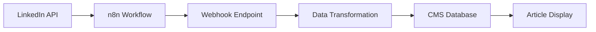

# n8n LinkedIn Integration Documentation

## Overview

This integration allows automatic import of LinkedIn posts into the Workflo CMS through n8n workflows. All LinkedIn posts are automatically converted to articles and stored in the database with full metadata preservation.

## Quick Start

### Webhook URL
```
POST https://your-domain.com/api/n8n/linkedin
```

### Test Interface
```
GET https://your-domain.com/api/n8n/test
```

## Architecture



## API Endpoints

### 1. Main Webhook Endpoint

**URL:** `/api/n8n/linkedin`  
**Method:** `POST`  
**Content-Type:** `application/json`

#### Request Payload

```json
{
  "linkedinId": "urn:li:share:1234567890",     // Optional but recommended
  "author": "Workflo B.V.",                     // Required
  "content": "Post content here...",            // Required
  "url": "https://linkedin.com/posts/...",      // Optional
  "publishedAt": "2025-08-28T10:00:00Z",       // Optional (ISO 8601)
  "imageUrl": "https://media.licdn.com/...",    // Optional
  "likes": 42,                                  // Optional
  "comments": 5,                                // Optional
  "shares": 3,                                  // Optional
  "hashtags": ["#Tech", "#Innovation"],         // Optional
  "companyPage": "Workflo B.V.",               // Optional
  "postType": "text",                          // Optional: text|image|video|article|poll
  "metrics": {                                  // Optional
    "impressions": 1000,
    "clicks": 50,
    "engagementRate": 5.5
  }
}
```

#### Response - Success (201)

```json
{
  "success": true,
  "message": "LinkedIn post successfully imported",
  "data": {
    "articleId": "uuid-here",
    "articleSlug": "linkedin-post-title-123456",
    "articleUrl": "/nieuws/linkedin-post-title-123456",
    "linkedinId": "urn:li:share:1234567890",
    "title": "LinkedIn: Post Title"
  },
  "meta": {
    "requestId": "n8n_1234567890_abc123",
    "processingTime": 145,
    "timestamp": "2025-08-28T10:00:00.000Z"
  }
}
```

#### Response - Duplicate (200)

```json
{
  "success": true,
  "message": "LinkedIn post already exists in the system",
  "duplicate": true,
  "linkedinId": "urn:li:share:1234567890",
  "requestId": "n8n_1234567890_abc123",
  "timestamp": "2025-08-28T10:00:00.000Z"
}
```

#### Response - Error (400/500)

```json
{
  "success": false,
  "error": "Validation failed",
  "message": "Content and author fields are required",
  "requestId": "n8n_1234567890_abc123",
  "timestamp": "2025-08-28T10:00:00.000Z"
}
```

### 2. Test Endpoint

**URL:** `/api/n8n/test`  
**Method:** `GET` or `POST`

#### GET - Test Interface
Opens an interactive web interface for testing the webhook with sample payloads.

#### POST - Automated Testing
```json
{
  "payload": "basic" | "withImage" | "withMetrics" | "article" | "minimal" | {custom object}
}
```

### 3. Health Check

**URL:** `/api/n8n/linkedin?config=true`  
**Method:** `GET`

Returns configuration details and expected payload structure.

## n8n Workflow Setup

### Step 1: Create a New Workflow

1. Open n8n
2. Create a new workflow
3. Name it "LinkedIn to CMS Import"

### Step 2: Add LinkedIn Trigger

Use one of these methods:

#### Option A: LinkedIn RSS Feed
```
1. Add "RSS Feed Trigger" node
2. URL: https://www.linkedin.com/feed/rss/
3. Poll Time: 15 minutes
```

#### Option B: LinkedIn API (requires API access)
```
1. Add "HTTP Request" node
2. Configure LinkedIn OAuth2
3. Endpoint: /v2/shares
```

#### Option C: Manual Trigger with Data
```
1. Add "Manual Trigger" node
2. Add test data for development
```

### Step 3: Transform Data

Add a "Code" node with this transformation:

```javascript
// LinkedIn RSS to Webhook format
const items = $input.all();

return items.map(item => {
  const linkedinData = item.json;
  
  // Extract LinkedIn ID from guid or link
  const linkedinId = linkedinData.guid || 
                     linkedinData.link?.split('/').pop() || 
                     `linkedin_${Date.now()}`;
  
  // Parse hashtags from content
  const hashtags = (linkedinData.description || '')
    .match(/#\w+/g) || [];
  
  return {
    json: {
      linkedinId: linkedinId,
      author: linkedinData.author || "Workflo B.V.",
      content: linkedinData.description || linkedinData.title,
      url: linkedinData.link,
      publishedAt: linkedinData.pubDate || new Date().toISOString(),
      imageUrl: linkedinData.enclosure?.url || linkedinData.image,
      hashtags: hashtags,
      postType: linkedinData.enclosure?.type?.includes('image') ? 'image' : 'text'
    }
  };
});
```

### Step 4: Send to Webhook

1. Add "HTTP Request" node
2. Configuration:
   - **URL:** `https://your-domain.com/api/n8n/linkedin`
   - **Method:** POST
   - **Authentication:** None (or add custom headers if needed)
   - **Body Content Type:** JSON
   - **Body Parameters:** Map fields from previous node

### Step 5: Handle Response

Add "IF" node to handle success/failure:

```
Success Path:
- Log to file
- Send success notification
- Update tracking spreadsheet

Failure Path:
- Send alert email
- Log error details
- Retry with exponential backoff
```

## Complete n8n Workflow Example

```json
{
  "name": "LinkedIn to CMS Import",
  "nodes": [
    {
      "parameters": {
        "pollTimes": {
          "item": [{"mode": "everyX", "value": 15, "unit": "minutes"}]
        },
        "feedUrl": "https://www.linkedin.com/feed/rss/",
        "options": {}
      },
      "name": "RSS Feed Trigger",
      "type": "n8n-nodes-base.rssFeedTrigger",
      "position": [250, 300]
    },
    {
      "parameters": {
        "jsCode": "// Transform RSS to webhook format\nconst output = [];\nfor (const item of $input.all()) {\n  const data = item.json;\n  output.push({\n    json: {\n      author: \"Workflo B.V.\",\n      content: data.description || data.title,\n      url: data.link,\n      publishedAt: data.pubDate,\n      linkedinId: data.guid || data.link\n    }\n  });\n}\nreturn output;"
      },
      "name": "Transform Data",
      "type": "n8n-nodes-base.code",
      "position": [450, 300]
    },
    {
      "parameters": {
        "url": "https://your-domain.com/api/n8n/linkedin",
        "method": "POST",
        "bodyParametersUi": {
          "parameter": [
            {"name": "linkedinId", "value": "={{$json[\"linkedinId\"]}}"},
            {"name": "author", "value": "={{$json[\"author\"]}}"},
            {"name": "content", "value": "={{$json[\"content\"]}}"},
            {"name": "url", "value": "={{$json[\"url\"]}}"},
            {"name": "publishedAt", "value": "={{$json[\"publishedAt\"]}}"}
          ]
        }
      },
      "name": "Send to CMS",
      "type": "n8n-nodes-base.httpRequest",
      "position": [650, 300]
    }
  ],
  "connections": {
    "RSS Feed Trigger": {"main": [["Transform Data"]]},
    "Transform Data": {"main": [["Send to CMS"]]}
  }
}
```

## Data Transformation

### How LinkedIn Posts Become Articles

1. **Title Generation**
   - Takes first 100 characters of content
   - Prefixes with "LinkedIn: "
   - Example: "LinkedIn: Excited to announce our latest..."

2. **Slug Creation**
   - Converts title to URL-safe format
   - Adds LinkedIn ID or timestamp for uniqueness
   - Example: `linkedin-excited-announce-latest-1234567890`

3. **Content Formatting**
   - Preserves original post content
   - Converts hashtags to clickable links
   - Adds metadata section with engagement metrics
   - Wraps in proper HTML structure

4. **Category & Tags**
   - Default category: "Social Media"
   - Tags include: "LinkedIn", "Social Media", plus any hashtags
   - Automatically cleaned and deduplicated

5. **Metadata Storage**
   - LinkedIn ID stored for duplicate detection
   - Engagement metrics tracked separately
   - Import source and timestamp recorded

## Database Schema

### Articles Table Extension
```sql
-- LinkedIn posts are stored as articles with:
source: 'linkedin'
external_url: 'linkedin:{linkedinId}'
category: 'Social Media'
published: true (auto-published)
```

### LinkedIn Metadata Table
```sql
CREATE TABLE linkedin_post_metadata (
    id UUID PRIMARY KEY,
    article_id UUID REFERENCES articles(id),
    linkedin_id VARCHAR(255) UNIQUE,
    linkedin_url TEXT,
    likes INTEGER,
    comments INTEGER,
    shares INTEGER,
    impressions INTEGER,
    engagement_rate NUMERIC(5,2),
    hashtags TEXT[],
    imported_at TIMESTAMP,
    last_synced_at TIMESTAMP
);
```

## Security

### Authentication Options

1. **No Authentication** (default)
   - Suitable for internal networks
   - Relies on URL obscurity

2. **API Key** (recommended)
   ```bash
   # Set in .env
   N8N_API_KEY=your-secret-key-here
   ```
   
   Then add header in n8n:
   ```
   X-API-Key: your-secret-key-here
   ```

3. **HMAC Signature** (advanced)
   ```bash
   # Set in .env
   N8N_WEBHOOK_SECRET=your-hmac-secret
   ```
   
   The webhook will verify signatures in `X-N8N-Signature` header.

### Rate Limiting

- Default: 100 requests per 15 minutes per IP
- Configurable via environment variables
- Returns 429 status when exceeded

## Monitoring

### Analytics Tracking

All webhook calls are tracked in the analytics system:
- Success/failure rates
- Processing times
- Duplicate detection
- Error patterns

### Database Views

```sql
-- View LinkedIn post performance
SELECT * FROM linkedin_post_analytics;

-- Monitor webhook activity
SELECT * FROM n8n_webhook_activity;
```

### Logs

Check application logs for detailed information:
```bash
# Development
npm run dev

# Production
pm2 logs

# Docker
docker logs workflo-cms
```

## Troubleshooting

### Common Issues

#### 1. Webhook Returns 400 - Validation Error
**Cause:** Missing required fields (author, content)  
**Solution:** Ensure your n8n workflow sends all required fields

#### 2. Webhook Returns 200 - Duplicate
**Cause:** LinkedIn post already imported  
**Solution:** This is normal behavior, post was previously imported

#### 3. Webhook Returns 500 - Server Error
**Cause:** Database connection issue or unexpected error  
**Solution:** Check server logs, verify database connection

#### 4. Posts Not Appearing on Website
**Cause:** Articles might be unpublished  
**Solution:** Check article status in CMS, LinkedIn posts are auto-published

#### 5. Special Characters Display Incorrectly
**Cause:** Encoding issue  
**Solution:** Ensure UTF-8 encoding throughout the pipeline

### Debug Mode

Enable debug logging:
```bash
# .env
DEBUG=n8n:*
LOG_LEVEL=debug
```

### Test Commands

```bash
# Test webhook is accessible
curl https://your-domain.com/api/n8n/linkedin

# Test with sample data
curl -X POST https://your-domain.com/api/n8n/linkedin \
  -H "Content-Type: application/json" \
  -d '{"author":"Test","content":"Test post"}'

# Check health and configuration
curl https://your-domain.com/api/n8n/linkedin?config=true
```

## Best Practices

1. **Unique LinkedIn IDs**
   - Always include linkedinId when available
   - Prevents duplicate imports
   - Enables update tracking

2. **Error Handling**
   - Implement retry logic in n8n
   - Log failed imports
   - Set up alerting for failures

3. **Performance**
   - Batch imports when possible
   - Implement rate limiting
   - Use async processing for large volumes

4. **Data Quality**
   - Validate data before sending
   - Clean HTML/special characters
   - Normalize hashtags format

5. **Monitoring**
   - Track import success rates
   - Monitor processing times
   - Alert on anomalies

## Support

### Resources
- Test Interface: `/api/n8n/test`
- Health Check: `/api/n8n/linkedin?config=true`
- Documentation: This file
- Support Email: support@workflo.it

### Integration Checklist

- [ ] Webhook endpoint deployed
- [ ] Database migrations applied
- [ ] n8n workflow created
- [ ] Test imports successful
- [ ] Monitoring configured
- [ ] Documentation reviewed
- [ ] Security measures implemented
- [ ] Error handling tested
- [ ] Production deployment complete

## Appendix

### Environment Variables

```bash
# Required
NEXT_PUBLIC_SUPABASE_URL=your-supabase-url
SUPABASE_SERVICE_ROLE_KEY=your-service-key

# Optional
N8N_WEBHOOK_SECRET=your-webhook-secret
N8N_API_KEY=your-api-key
DEBUG=n8n:*
LOG_LEVEL=info
```

### Sample LinkedIn Post IDs

- Share: `urn:li:share:1234567890`
- Activity: `urn:li:activity:1234567890`
- Article: `urn:li:article:1234567890`
- UGC Post: `urn:li:ugcPost:1234567890`

### Useful SQL Queries

```sql
-- Get all LinkedIn posts
SELECT * FROM articles WHERE source = 'linkedin';

-- Find duplicate attempts
SELECT linkedin_id, COUNT(*) 
FROM n8n_webhook_logs 
WHERE is_duplicate = true 
GROUP BY linkedin_id;

-- Top performing LinkedIn posts
SELECT a.title, lpm.likes, lpm.comments, lpm.shares
FROM articles a
JOIN linkedin_post_metadata lpm ON a.id = lpm.article_id
ORDER BY (lpm.likes + lpm.comments + lpm.shares) DESC
LIMIT 10;

-- Recent webhook activity
SELECT * FROM n8n_webhook_logs 
ORDER BY received_at DESC 
LIMIT 50;
```

---

*Last updated: 2025-09-04*  
*Version: 1.0.0*  
*Author: Claude Code - Workflo n8n Integration*